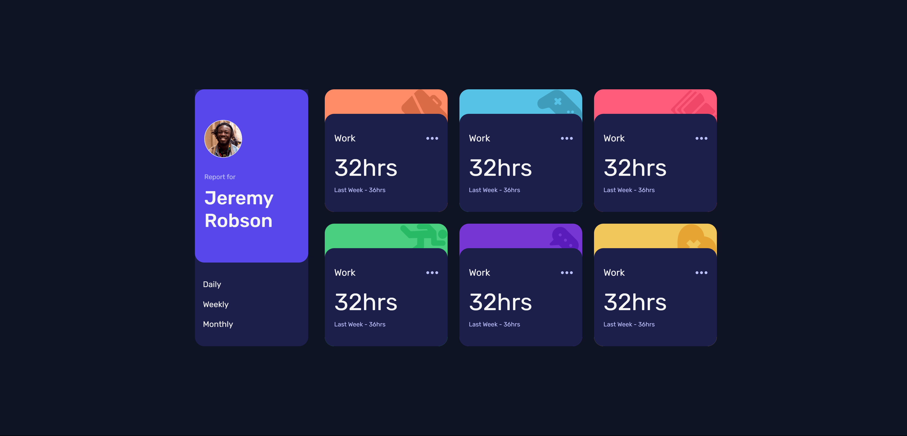
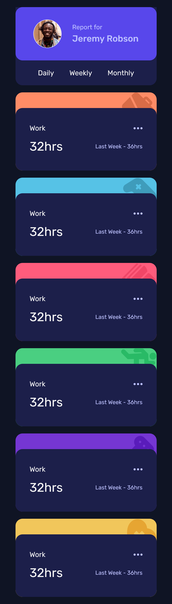

# Frontend Mentor - Time tracking dashboard solution

This is a solution to the [Time tracking dashboard challenge on Frontend Mentor](https://www.frontendmentor.io/challenges/time-tracking-dashboard-UIQ7167Jw). Frontend Mentor challenges help you improve your coding skills by building realistic projects.

## Table of contents

- [Overview](#overview)
  - [The challenge](#the-challenge)
  - [Screenshot](#screenshot)
- [My process](#my-process)
  - [Built with](#built-with)
  - [What I learned](#what-i-learned)

## Overview

### The challenge

Users should be able to:

- View the optimal layout for the site depending on their device's screen size
- See hover states for all interactive elements on the page
- Switch between viewing Daily, Weekly, and Monthly stats

### Screenshot




## My process

### Built with

- Semantic HTML5 markup
- CSS custom properties
- Flexbox
- CSS Grid
- SCSS

### What I learned

```css
  # usage of pseudo classes
     .article:nth-of-type(2),

```

```js
const htmlExtraction = (dataOby, linkTarget) => {
  let htmlStr = "";
  // Iterate over each element in dataOby
  for (const timeFrames of dataOby) {
    // Construct HTML for each timeFrames entry
    htmlStr += `
      <article class="article">
          <div class="article container">
            <div class="activity-tab">
              <p class="activity">${timeFrames.title}</p>
              
            </div>
            <div class="time-tab">
              <p class="time">${timeFrames.timeframes[linkTarget].current}hrs</p>
              <p class="total-time">last week - ${timeFrames.timeframes[linkTarget].previous}hrs</p>
            </div>
          </div>
        </article>
      `;
  }

  return htmlStr;
};
```
